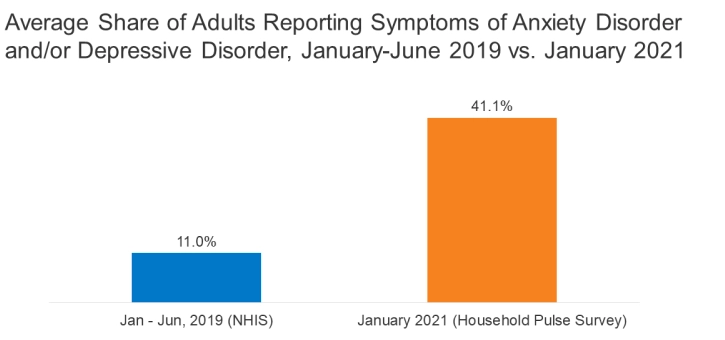

# Minerva
A discord bot which looks for depressive behavior in the server chats, and try to help a potentially serious case with a voice conversation styled question/answer session by providing links to relevant resources and helplines. It also moderates acts of hate-speech like **Racism**,**Feminism** and other forms in the server.

## Introduction
CoVID-19 has confined almost all of us to our homes and has affected our lives in ways that were beyond imaginable. The challenges that we face are stressful and overwhelming and cause strong emotions among both children and adults.  Studies show a significant increase in adults' cases of depression and anxiety since the CoVID-19 invasion. The below image([Source](https://www.kff.org/coronavirus-covid-19/issue-brief/the-implications-of-covid-19-for-mental-health-and-substance-use/)) gives an idea of this.

This home confinement has also forced us to utilize chat platforms like *Discord*, *Telegram* and others to communicate with our peers and have overall increased the online presence of almost everybody. This increase in the users has led to demand for tools that efficiently moderate these platforms against instances of Hate-Speech like **Racism**, **Feminism** and other forms to make these platforms a safe place for people from all walks of life where they can meet and connect regardless of their backgrounds. 

For this, we bring a potential solution for the Discord platform, **Minerva**.

Minerva, named after the Roman goddess of wisdom and battle strategy, is a **Discord-Bot** that moderates the chat by looking for instances of Hate-Speech in the chat and also looks for signs of Depressive behavior among the users, and try to aid them through a voice conversation styled question/answer session and provide them with links and helpline numbers if a problem is recognized.

## Usage
### 1. Depressive Behavior Analyzer
The bot reads all the messages being sent on the server, and using a Deep Neural Network model made using Tensorflow, that has been trained on a dataset with over 100,000 data points, analyzes the message and assigns a depression score to it ranging from [0,1]. If the score is over a certain threshold, it is added to a list specific to that user, which contains similar messages that they may have sent earlier. This collection is stored on GraphCMS. The current score of a user is the number of messages linked to them. If this overall score crosses a certain number, we identify a repeating pattern of depression and the bot sends a message user saying "Come talk to me in any Voice Channel, send `~here` when you are in a Voice Channel". When the user joins a voice channel and sends the message `~here`, the bot joins the voice channel, and asks a series of questions and collects the user's responses the user responds, all the while evaluating the intents of the responses using the Google Dialogflow API. Based on the intent score we DM to the user links and helpline numbers if it is needed.

### 2. Hate-Speech Moderation
Minerva is able to detect any instances of Hate-Speech being used in the server text messages. She reacts to them depending on what kind of hate-speech is used. The reactions are as follows:

* 'FLIRTATION': '💋'
* 'TOXICITY': '🧨'
* 'INSULT': '👊'
* 'SPAM': '🐟'

Using the `~karma` command anybody can look at the records of their behavior on the server. Admins can look at this and take appropriate action that they deem necessary.

## Technologies used
The technology used are as follows:

* `python 3`
* `tensorflow`
* `Google Cloud Text-To-Speech`
* `Azure Cognitive Speech`
* `Keras`
* `Discord.js`

## Members
* [Ritvik Aryan Kalra](https://github.com/rvk7895)
* [Dhruv Kapur](https://github.com/dkapur17)
* [Sidharth Giri](https://github.com/Sidx-sys)
* [Arihanth Srikar](https://github.com/Arihanth007)